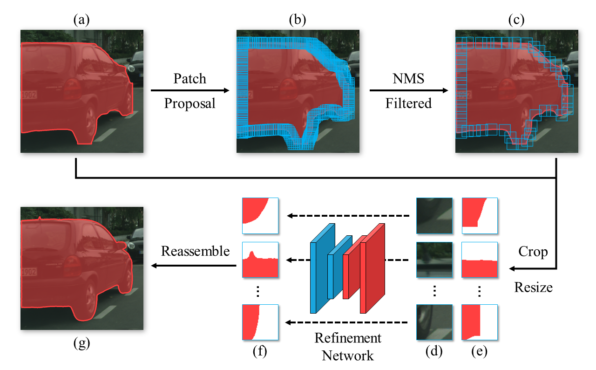

# Look Closer to Segment Better: Boundary Patch Refinement for Instance Segmentation (CVPR 2021)

## Introduction

PBR is a conceptually simple yet effective post-processing refinement framework to improve the boundary quality of instance segmentation. Following the idea of looking closer to segment boundaries better, BPR extracts and refines a series of small boundary patches along the predicted instance boundaries. The proposed BPR framework (as shown below) yields significant improvements over the Mask R-CNN baseline on the Cityscapes benchmark, especially on the boundary-aware metrics. 


<p align="center">

</p>

For more details, please refer to our [paper](https://arxiv.org/abs/2104.05239).

## Installation

Please refer to [INSTALL.md](docs/install.md).


## Training

### Prepare patches dataset [optional]

First, you need to generate the instance segmentation results on the Cityscapes training and validation set, as the following format:

```
maskrcnn_train
- aachen_000000_000019_leftImg8bit_pred.txt
- aachen_000001_000019_leftImg8bit_0_person.png
- aachen_000001_000019_leftImg8bit_10_car.png
- ...

maskrcnn_val
- frankfurt_000001_064130_leftImg8bit_pred.txt
- frankfurt_000001_064305_leftImg8bit_0_person.png
- frankfurt_000001_064305_leftImg8bit_10_motorcycle.png
- ...
```

The content of the txt file is the same as the standard format required by [cityscape script](https://github.com/mcordts/cityscapesScripts/blob/master/cityscapesscripts/evaluation/evalInstanceLevelSemanticLabeling.py), e.g.:

```
frankfurt_000000_000294_leftImg8bit_0_person.png 24 0.9990299940109253
frankfurt_000000_000294_leftImg8bit_1_person.png 24 0.9810258746147156
...
```

Then use the provided script to generate the training set:

```
sh tools/prepare_dataset.sh \
  maskrcnn_train \
  maskrcnn_val \
  maskrcnn_r50
```
Note that this step can take about 2 hours. Feel free to skip it by downloading the [processed training set](https://cloud.tsinghua.edu.cn/f/ea643dc32f824dbba28a/?dl=1).


### Train the network

Point `DATA_ROOT` to the patches dataset and run the training script 

```
DATA_ROOT=maskrcnn_r50/patches \
bash tools/dist_train.sh \
  configs/bpr/hrnet18s_128.py \
  4
```


## Inference

Suppose you have some instance segmentation results of Cityscapes dataset, as the following format:

```
maskrcnn_val
- frankfurt_000001_064130_leftImg8bit_pred.txt
- frankfurt_000001_064305_leftImg8bit_0_person.png
- frankfurt_000001_064305_leftImg8bit_10_motorcycle.png
- ...
```

We provide a script ([tools/inference.sh](tools/inference.sh)) to perform refinement operation, usage:

```
IOU_THRESH=0.55 \
IMG_DIR=data/cityscapes/leftImg8bit/val \
GT_JSON=data/cityscapes/annotations/instancesonly_filtered_gtFine_val.json \
BPR_ROOT=. \
GPUS=4 \
sh tools/inference.sh configs/bpr/hrnet48_256.py ckpts/hrnet48_256.pth maskrcnn_val maskrcnn_val_refined
```

The refinement results will be saved in `maskrcnn_val_refined/refined`.

For COCO model, use [tools/inference_coco.sh](tools/inference_coco.sh) instead.


## Models

| Backbone | Dataset | Checkpoint |
| :------: | :------: | :------: |
| HRNet-18s | Cityscapes | [Tsinghua Cloud](https://cloud.tsinghua.edu.cn/f/a15da4d679654111ba89/?dl=1) |
| HRNet-48 | Cityscapes | [Tsinghua Cloud](https://cloud.tsinghua.edu.cn/f/54d7c737540444b38b18/?dl=1) |
| HRNet-18s | COCO | [Tsinghua Cloud](https://cloud.tsinghua.edu.cn/f/342fae1311b748a8b396/?dl=1) |

## Acknowledgement

This project is based on [mmsegmentation](https://github.com/open-mmlab/mmsegmentation) code base.

## Citation

If you find this project useful in your research, please consider citing:

```
@article{tang2021look,
  title={Look Closer to Segment Better: Boundary Patch Refinement for Instance Segmentation},
  author={Chufeng Tang and Hang Chen and Xiao Li and Jianmin Li and Zhaoxiang Zhang and Xiaolin Hu},
  journal={arXiv preprint arXiv:2104.05239},
  year={2021}
}
```
